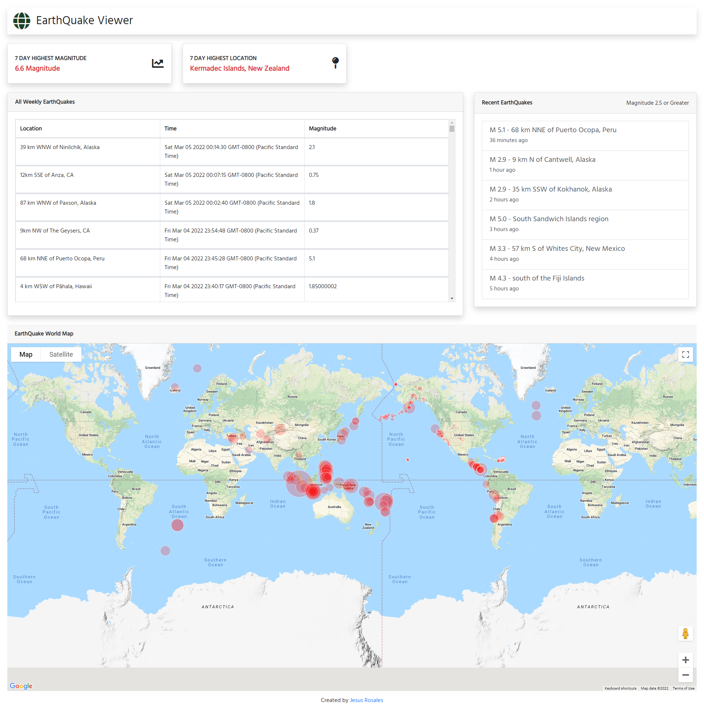

# EarthQuake Dashboard Project

 This is a Project used to view recent earthquakes. Dashboard includes
  -latest earthquakes 2.5 magnitude and above.
  -table with 7 days of tracked earthquakes.
  -google map of recent earthquakes worldwide.

  ## Built With
    - Html
    - CSS
    - Bootstrap
    - Javascript

 ## Resouces 
  -  Google Maps Visualizing Data - https://developers.google.com/maps/documentation/javascript/earthquakes
  - USGS - https://earthquake.usgs.gov/fdsnws/event/1/

